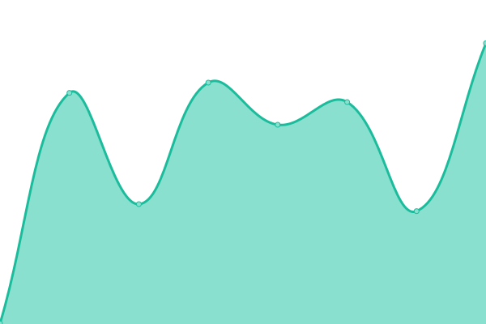
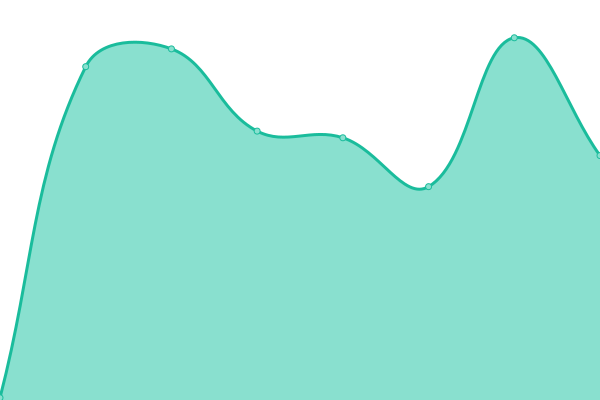

# [📈 Live Status](https://EliasMET.github.io/sdhs-monitoring): <!--live status--> **🟧 Partial outage**

This repository contains the open-source uptime monitor and status page for [Elias](https://EliasMET.github.io/sdhs-monitoring), powered by [Upptime](https://github.com/upptime/upptime).

With [Upptime](https://upptime.js.org), you can get your own unlimited and free uptime monitor and status page, powered entirely by a GitHub repository. We use [Issues](https://github.com/EliasMET/sdhs-monitoring/issues) as incident reports, [Actions](https://github.com/EliasMET/sdhs-monitoring/actions) as uptime monitors, and [Pages](https://EliasMET.github.io/sdhs-monitoring) for the status page.

<!--start: status pages-->
<!-- This summary is generated by Upptime (https://github.com/upptime/upptime) -->
<!-- Do not edit this manually, your changes will be overwritten -->
<!-- prettier-ignore -->
| URL | Status | History | Response Time | Uptime |
| --- | ------ | ------- | ------------- | ------ |
|  API Backend | 🟩 Up | [api-backend.yml](https://github.com/EliasMET/sdhs-monitoring/commits/HEAD/history/api-backend.yml) | 

 88ms
     
 | 

<a href="https://EliasMET.github.io/sdhs-monitoring/history/api-backend">98.79%</a>
    

|  [Roblox](https://roblox.com) | 🟩 Up | [roblox.yml](https://github.com/EliasMET/sdhs-monitoring/commits/HEAD/history/roblox.yml) | 

 441ms
     
 | 

<a href="https://EliasMET.github.io/sdhs-monitoring/history/roblox">100.00%</a>
    

|  [Bloxlink API](https://api.blox.link/v4) | 🟩 Up | [bloxlink-api.yml](https://github.com/EliasMET/sdhs-monitoring/commits/HEAD/history/bloxlink-api.yml) | 

 169ms
     
 | 

<a href="https://EliasMET.github.io/sdhs-monitoring/history/bloxlink-api">100.00%</a>
    

|  Discord Bot | 🟥 Down | [discord-bot.yml](https://github.com/EliasMET/sdhs-monitoring/commits/HEAD/history/discord-bot.yml) | 

 161ms
     
 | 

<a href="https://EliasMET.github.io/sdhs-monitoring/history/discord-bot">99.13%</a>
    

|  Agent Discord Bot | 🟥 Down | [agent-discord-bot.yml](https://github.com/EliasMET/sdhs-monitoring/commits/HEAD/history/agent-discord-bot.yml) | 

 42ms
     
 | 

<a href="https://EliasMET.github.io/sdhs-monitoring/history/agent-discord-bot">99.31%</a>
    

<!--end: status pages-->

[**Visit our status website →**](https://EliasMET.github.io/sdhs-monitoring)

## 📄 License

- Powered by: [Upptime](https://github.com/upptime/upptime)
- Code: [MIT](./LICENSE) © [Anand Chowdhary](https://anandchowdhary.com), supported by [Pabio](https://pabio.com)
- Data in the `./history` directory: [Open Database License](https://opendatacommons.org/licenses/odbl/1-0/)
